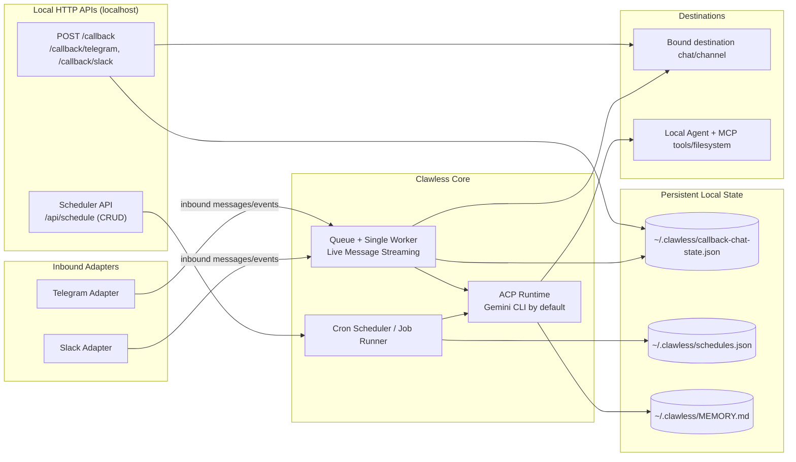

# Clawless — Bring Your Own Agent (Interface + ACP)

Clawless is an interface bridge built around one core idea: **Bring Your Own Agent**.

Instead of forcing a built-in runtime, Clawless lets you keep your preferred local ACP-capable CLI (Gemini CLI by default) and adds a reliable interface layer, callbacks, and scheduling on top.

Today, Telegram and Slack are supported interface adapters.

## Bring Your Own Agent (Main Value)

Clawless is designed so your messaging layer and automation layer stay stable while your agent runtime can change.

- Keep your preferred local agent CLI workflow
- Keep your existing MCP tools and local files
- Swap runtimes without rebuilding your bot integration
- Avoid lock-in to a single all-in-one framework

## Why Clawless

If you have tried heavier all-in-one agent frameworks, Clawless is the minimal alternative:

- **BYO-agent first**: use your preferred local ACP-capable CLI runtime
- **Lightweight setup**: minimal glue instead of a full platform migration
- **Local-first control**: your machine, your tools, your data flow
- **Transport only**: interface layer is separate from the agent runtime

## Interface Adapters

- **Current adapters**: Telegram, Slack
- **Platform selection**: Choose your preferred messaging platform via configuration
- **Design goal**: keep one message context contract so all interfaces reuse queueing, callbacks, scheduler, and ACP flow

## Features

- 🔀 **Bring Your Own Agent Runtime**: Keep messaging/callback/scheduler UX while choosing your preferred local ACP-capable CLI
- 🔌 **Multi-Platform Interface Layer**: Telegram and Slack support
- 🤖 **Multiple Messaging Platforms**: Interact with your local agent runtime through Telegram or Slack
- ⌨️ **Typing Status UX**: Shows typing indicator while the agent is processing (platform-dependent)
- 🛠️ **Rich Tool Support**: Leverages MCP (Model Context Protocol) servers connected to your local CLI runtime
- 🔒 **Privacy**: Runs on your hardware, you control data flow
- 💾 **Persistent Context**: Maintains local session unlike standard API calls
- 📬 **Sequential Queueing**: Processes one message at a time to avoid overlap and races
- 🔔 **Local Callback Endpoint**: Accepts localhost HTTP POST requests and forwards payloads to your messaging platform
- ⏰ **Cron Scheduler**: Schedule tasks to run at specific times or on recurring basis via REST API

## Architecture



The bridge:
1. Receives messages from the active interface adapter (Telegram or Slack)
2. Forwards them to **your configured local agent CLI** via ACP (Agent Communication Protocol)
3. Sends interface-appropriate progress/status updates, then returns a single final response
4. Accepts localhost callback and scheduler API requests for async workflows
5. Persists scheduler/chat-binding/memory state under `~/.clawless`

## Prerequisites

- **Node.js** 18.0.0 or higher
- **A local ACP-capable agent CLI** installed and configured (Gemini CLI is the default setup)
- **Platform credentials** (choose one):
  - **Telegram**: Bot Token from [@BotFather](https://t.me/BotFather)
  - **Slack**: Bot Token, Signing Secret, and optionally App Token from [api.slack.com/apps](https://api.slack.com/apps)
    - If using email-based allowlist entries, add OAuth scopes: `users:read` and `users:read.email`

## Installation

### Option A: Install from npm (compiled CLI, recommended)

Install globally:

```bash
npm i -g clawless
```

Run:

```bash
clawless
```

This uses the published compiled CLI package from npmjs, so you do not need to clone or build the project locally.

For local development and advanced runtime/operator docs, see `AGENTS.md`.

## Getting a Telegram Bot Token

1. Open Telegram and search for [@BotFather](https://t.me/BotFather)
2. Send `/newbot` command
3. Follow the prompts to create your bot
4. Copy the token provided by BotFather
5. Paste it into your `.env` file

## Authorizing Users (Whitelist)

For security, the bot only accepts commands from authorized users. To configure:

1. **Use your Telegram username**:
  - You can use your Telegram username (e.g., `your_username` or `@your_username`).
  - If you don't have a username set, you must create one in Telegram settings.

2. **Add usernames to whitelist** in `~/.clawless/config.json`:
   ```json
   {
     "telegramToken": "your_bot_token",
    "telegramWhitelist": ["your_username", "another_user"]
   }
   ```

3. **Alternative: Use environment variable**:
   ```bash
   TELEGRAM_WHITELIST='["your_username", "another_user"]'
   ```

⚠️ **Security Note**: In Telegram mode, `telegramWhitelist` / `TELEGRAM_WHITELIST` must be configured and non-empty or startup will fail. Keep the list small (max 10 users) for safety.

For Slack mode, configure allowed Slack principals (user IDs or emails) with `slackWhitelist` / `SLACK_WHITELIST`.

```bash
SLACK_WHITELIST='["U01234567", "user@example.com"]'
```

⚠️ **Security Note**: In Slack mode, `slackWhitelist` / `SLACK_WHITELIST` must be configured and non-empty or startup will fail. Keep the list small (max 10 users). Email matching requires OAuth scopes `users:read` and `users:read.email`.

## Usage

### CLI Mode

After global install from npm (`npm i -g clawless`), run:

```bash
clawless
```

You can also run without global install:

```bash
npx clawless
```

> Note: the binary name is `clawless`.

### Config File (CLI)

On first run, the CLI automatically creates:

```text
~/.clawless/config.json
```

with placeholder values, then exits so you can edit it.

After updating placeholders, run again:

```bash
clawless
```

You can also use a custom path:

```bash
clawless --config /path/to/config.json
```

If the custom config path does not exist, a template file is created there as well.

You can still bootstrap from the example file if preferred:

```bash
cp clawless.config.example.json ~/.clawless/config.json
```

Environment variables still work and take precedence over config values.

### Configuration Reference (Consolidated)

Clawless supports both JSON config keys and environment variables for runtime settings.

- Precedence: `environment variables` > `config file values` > `built-in defaults`
- Config file path selection is controlled by env/CLI only:
  - `--config /path/to/config.json`
  - `AGENT_BRIDGE_CONFIG`
  - `GEMINI_BRIDGE_CONFIG` (legacy alias)

#### Config key ↔ environment variable mapping

| Config key | Environment variable |
|---|---|
| `messagingPlatform` | `MESSAGING_PLATFORM` |
| `telegramToken` | `TELEGRAM_TOKEN` |
| `telegramWhitelist` | `TELEGRAM_WHITELIST` |
| `slackBotToken` | `SLACK_BOT_TOKEN` |
| `slackSigningSecret` | `SLACK_SIGNING_SECRET` |
| `slackAppToken` | `SLACK_APP_TOKEN` |
| `slackWhitelist` | `SLACK_WHITELIST` |
| `timezone` | `TZ` |
| `typingIntervalMs` | `TYPING_INTERVAL_MS` |
| `streamUpdateIntervalMs` | `STREAM_UPDATE_INTERVAL_MS` |
| `geminiCommand` | `GEMINI_COMMAND` |
| `geminiApprovalMode` | `GEMINI_APPROVAL_MODE` |
| `geminiModel` | `GEMINI_MODEL` |
| `acpPermissionStrategy` | `ACP_PERMISSION_STRATEGY` |
| `geminiTimeoutMs` | `GEMINI_TIMEOUT_MS` |
| `geminiNoOutputTimeoutMs` | `GEMINI_NO_OUTPUT_TIMEOUT_MS` |
| `geminiKillGraceMs` | `GEMINI_KILL_GRACE_MS` |
| `acpPrewarmRetryMs` | `ACP_PREWARM_RETRY_MS` |
| `acpPrewarmMaxRetries` | `ACP_PREWARM_MAX_RETRIES` |
| `acpMcpServersJson` | `ACP_MCP_SERVERS_JSON` |
| `maxResponseLength` | `MAX_RESPONSE_LENGTH` |
| `acpStreamStdout` | `ACP_STREAM_STDOUT` |
| `acpDebugStream` | `ACP_DEBUG_STREAM` |
| `heartbeatIntervalMs` | `HEARTBEAT_INTERVAL_MS` |
| `callbackHost` | `CALLBACK_HOST` |
| `callbackPort` | `CALLBACK_PORT` |
| `callbackAuthToken` | `CALLBACK_AUTH_TOKEN` |
| `callbackMaxBodyBytes` | `CALLBACK_MAX_BODY_BYTES` |
| `agentBridgeHome` | `AGENT_BRIDGE_HOME` |
| `memoryFilePath` | `MEMORY_FILE_PATH` |
| `memoryMaxChars` | `MEMORY_MAX_CHARS` |
| `schedulesFilePath` | `SCHEDULES_FILE_PATH` |

Notes:
- Uppercase env-style keys can also be used directly inside `config.json` if preferred.

### Run In Background

Simple background run:

```bash
nohup clawless > clawless.log 2>&1 &
```

For production hosting, use any process manager or platform you prefer (for example: systemd, PM2, Docker, or your cloud runtime).

## Advanced Docs

For runtime configuration, callback/scheduler APIs, troubleshooting, queue/flow internals, development notes, and security guidance, see `AGENTS.md`.

## License

MIT License - see [LICENSE](LICENSE) file for details

## Credits

Built with:
- [Telegraf](https://telegraf.js.org/) - Telegram Bot framework
- [@slack/bolt](https://slack.dev/bolt-js/) - Slack Bot framework
- [@agentclientprotocol/sdk](https://www.npmjs.com/package/@agentclientprotocol/sdk) - Agent Communication Protocol SDK

## Support

For issues and questions:
- Open an issue on GitHub
- Check existing issues for solutions
- Review Gemini CLI documentation

---

**Note**: This bridge requires a working local ACP-capable CLI (Gemini CLI is the default setup). Ensure your CLI is properly configured before running the bridge.
