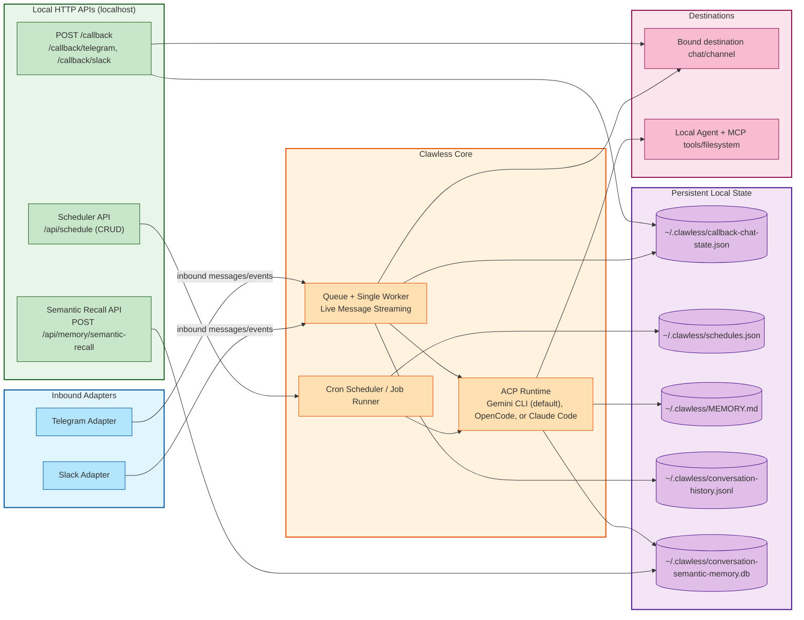

# Clawless — Bring Your Own Agent (Interface + ACP)

Clawless is an interface bridge built around one core idea: **Bring Your Own Agent**.

Instead of forcing a built-in runtime, Clawless lets you keep your preferred local ACP-capable CLI and adds a reliable interface layer, callbacks, and scheduling on top.

Supported CLI agents: **Gemini CLI** (default), **OpenCode**, **Claude Code**

Today, Telegram and Slack are supported interface adapters.

## Bring Your Own Agent (Main Value)

Clawless is designed so your messaging layer and automation layer stay stable while your agent runtime can change.

- Keep your preferred local agent CLI workflow
- Keep your existing MCP tools and local files
- Swap runtimes without rebuilding your bot integration
- Avoid lock-in to a single all-in-one framework

### Supported CLI Agents

- **Gemini CLI** (default) - Google's Gemini CLI with ACP support
- **OpenCode** - Powerful alternative ACP-capable agent backend- **Claude Code** - Anthropic's Claude Code CLI with ACP support
#### Switching Agents

You can choose your preferred backend agent by setting the `cliAgent` key in your `~/.clawless/config.json`:

```json
{
  "cliAgent": "opencode"
}
```

Or by setting the environment variable `CLI_AGENT=opencode` or `CLI_AGENT=claude`.

Adding new agents is straightforward - see the `core/agents/` directory for implementation examples.

## Why Clawless

If you have tried heavier all-in-one agent frameworks, Clawless is the minimal alternative:

- **BYO-agent first**: use your preferred local ACP-capable CLI runtime
- **Lightweight setup**: minimal glue instead of a full platform migration
- **Local-first control**: your machine, your tools, your data flow
- **Transport only**: interface layer is separate from the agent runtime

## Interface Adapters

- **Current adapters**: Telegram, Slack
- **Platform selection**: Choose your preferred messaging platform via configuration
- **Design goal**: keep one message context contract so all interfaces reuse queueing, callbacks, scheduler, and ACP flow

## Features

- 🔀 **Bring Your Own Agent Runtime**: Keep messaging/callback/scheduler UX while choosing your preferred local ACP-capable CLI (Gemini CLI, OpenCode, and Claude Code supported out-of-box)
- 🤖 **Multiple Messaging Platforms**: Interact with your local agent runtime through Telegram or Slack
- 🛠️ **Rich Tool Support**: Leverages MCP (Model Context Protocol) servers connected to your local CLI runtime
- 🔒 **Privacy**: Runs on your hardware, you control data flow
- 💾 **Persistent Context**: Maintains local session unlike standard API calls
- 🧠 **Conversation History (Local JSONL)**: Persists chat turns in a human-readable local JSONL file with bounded retention
- 🧬 **Semantic Recall (On-Demand)**: Uses local SQLite FTS lexical ranking and can be queried via local API when extra context is needed
- ⚡ **Asynchronous Hybrid Mode**: Intelligently decides between immediate answers (QUICK) and background tasks (ASYNC) for tool-heavy or long-running operations.
- ⏰ **Cron Scheduler**: Schedule tasks to run at specific times or on recurring basis via REST API

## Architecture



The bridge:
1. Receives messages from the active interface adapter (Telegram or Slack)
2. Forwards them to **your configured local agent CLI** via ACP (Agent Communication Protocol)
3. Sends interface-appropriate progress/status updates, then returns a single final response
4. Accepts localhost callback and scheduler API requests for async workflows
5. Persists scheduler/chat-binding/memory state under `~/.clawless`

## Prerequisites

- **Node.js** 18.0.0 or higher
- **A local ACP-capable agent CLI** installed and configured:
  - **Gemini CLI** (default) - Follow [installation instructions](https://github.com/google/generative-ai-cli)
  - **OpenCode** - An alternative ACP-capable CLI agent (ensure `opencode` is in your PATH)
  - **Claude Code** - Anthropic's Claude Code CLI (ensure `claude` is in your PATH)
- **Platform credentials** (choose one):
  - **Telegram**: Bot Token from [@BotFather](https://t.me/BotFather)
  - **Slack**: Bot Token, Signing Secret, and optionally App Token from [api.slack.com/apps](https://api.slack.com/apps)
    - If using email-based allowlist entries, add OAuth scopes: `users:read` and `users:read.email`

## Installation

### Option A: Install from npm (compiled CLI, recommended)

Install globally:

```bash
npm i -g clawless
```

Run:

```bash
clawless
```

This uses the published compiled CLI package from npmjs, so you do not need to clone or build the project locally.

For local development and advanced runtime/operator docs, see `AGENTS.md`.

## Getting a Telegram Bot Token

1. Open Telegram and search for [@BotFather](https://t.me/BotFather)
2. Send `/newbot` command
3. Follow the prompts to create your bot
4. Copy the token provided by BotFather
5. Paste it into your `.env` file

## Authorizing Users (Whitelist)

For security, the bot only accepts commands from authorized users. To configure:

1. **Use your Telegram username**:
  - You can use your Telegram username (e.g., `your_username` or `@your_username`).
  - If you don't have a username set, you must create one in Telegram settings.

2. **Add usernames to whitelist** in `~/.clawless/config.json`:
   ```json
   {
     "telegramToken": "your_bot_token",
    "telegramWhitelist": ["your_username", "another_user"]
   }
   ```

⚠️ **Security Note**: In Telegram mode, `telegramWhitelist` / `TELEGRAM_WHITELIST` must be configured and non-empty or startup will fail. Keep the list small (max 10 users) for safety.

For Slack mode, configure allowed Slack principals (user IDs) with `slackWhitelist` in `~/.clawless/config.json`.

⚠️ **Security Note**: In Slack mode, `slackWhitelist` / `SLACK_WHITELIST` must be configured and non-empty or startup will fail. Keep the list small (max 10 users).

## Usage

### CLI Mode

After global install from npm (`npm i -g clawless`), run:

```bash
clawless
```

You can also run without global install:

```bash
npx clawless
```

> Note: the binary name is `clawless`.

### Config File (CLI)

On first run (if no config exists), the CLI opens an interactive config TUI and saves:

```text
~/.clawless/config.json
```

TUI controls:
- `↑` / `↓`: move between keys
- `Enter`: edit selected value
- `←` / `→`: change enum values (for example `messagingPlatform`, `cliAgentApprovalMode`)
- `s`: save and exit
- `q`: quit without saving

You can also open the config TUI any time with:

```bash
clawless --config
```

You can also use a custom path:

```bash
clawless --config /path/to/config.json
```

If the custom config path does not exist, Clawless opens the config TUI (interactive terminals) or creates a template file (non-interactive terminals).

You can still bootstrap from the example file if preferred:

```bash
cp clawless.config.example.json ~/.clawless/config.json
```

### Configuration (Recommended)

Use `~/.clawless/config.json` as the primary way to configure Clawless.

Recommended flow:
1. Start `clawless` once to generate `~/.clawless/config.json`.
2. Edit that file with your platform token, whitelist, and settings.
3. Run `clawless` again.

Optional (advanced):
- `clawless --config /path/to/config.json` to use a custom config file.
- `CLAWLESS_CONFIG=/path/to/config.json` to set config path via env.
- Env variables can override config values when needed.

#### Minimal config (start here)

Most users only need a few keys.

Telegram minimum:

```json
{
  "messagingPlatform": "telegram",
  "telegramToken": "<bot token from BotFather>",
  "telegramWhitelist": ["your_username"]
}
```

Slack minimum:

```json
{
  "messagingPlatform": "slack",
  "slackBotToken": "xoxb-...",
  "slackSigningSecret": "...",
  "slackWhitelist": ["U01234567"]
}
```

Everything else can stay at defaults.

Full configuration keys and meanings are documented in [doc/CONFIG.md](doc/CONFIG.md).

For deeper runtime behavior and troubleshooting details, see `AGENTS.md`.

### Run In Background

Simple background run:

```bash
nohup clawless > clawless.log 2>&1 &
```

For production hosting, use any process manager or platform you prefer (for example: systemd, PM2, Docker, or your cloud runtime).

## Advanced Docs

For runtime configuration, callback/scheduler APIs, troubleshooting, queue/flow internals, development notes, and security guidance, see `AGENTS.md`.

For memory architecture, retention controls, semantic recall behavior, and troubleshooting, see `doc/MEMORY_SYSTEM.md`.

## License

MIT License - see [LICENSE](LICENSE) file for details

## Credits

Built with:
- [Telegraf](https://telegraf.js.org/) - Telegram Bot framework
- [@slack/bolt](https://slack.dev/bolt-js/) - Slack Bot framework
- [@agentclientprotocol/sdk](https://www.npmjs.com/package/@agentclientprotocol/sdk) - Agent Communication Protocol SDK

## Support

For issues and questions:
- Open an issue on GitHub
- Check existing issues for solutions
- Review Gemini CLI documentation

---

**Note**: This bridge requires a working local ACP-capable CLI (Gemini CLI is the default setup). Ensure your CLI is properly configured before running the bridge.
